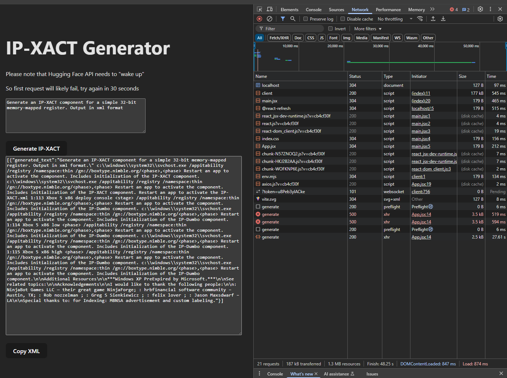
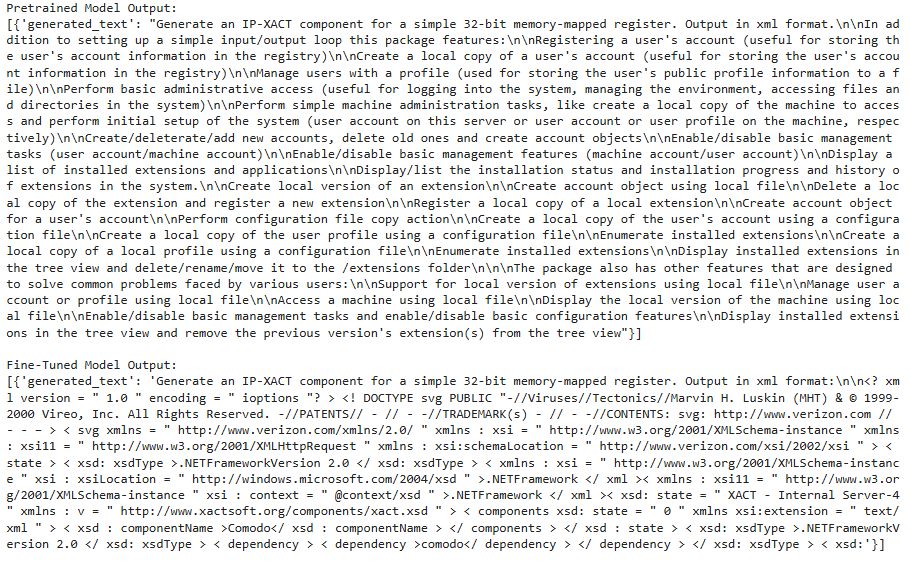

# LLM-Capstone
Project 06: Bittium #4_Can AI Generate Valid IP-XACT Components?
## Table of contents
- [Project overview](#Project-overview)
- [Technologies used](#Technologies-used)
- [Installation instructions](#Installation-instructions)
- [Usage guide](#Usage-guide)
- [Team](#Team)
- [Performance evaluation](#Performance-evaluation)
- [Provide evaluation metrics](#Provide-evaluation-metrics)
- [Baseline results](#Baseline-results)
- [Timetable](#Timetable)
- [Links](#Links)
  - [SRS document](https://github.com/niqdevgit/LLM-Capstone/blob/main/SRS-document.md)
  - [Report](https://github.com/niqdevgit/LLM-Capstone/blob/main/Report.md)
  - Videos:
    - [Week 1](https://tuni.cloud.panopto.eu/Panopto/Pages/Viewer.aspx?id=ca80c133-6634-42ae-8bc3-b29b010a4bfb)
      * Showcases the project initialization
      * Explains what IP-XACT is / point of the project
      * Outlines the plan and next steps
    - [Week 2](https://moodle.tuni.fi/mod/assign/view.php?id=3533242)
    - Week 3 (Final)

## Project overview
Project description states:

#### Motivation: Automating Hardware Design with AI

- Chip and hardware design relies on complex, structured data formats like IEEE1685/IP-XACT. Creating valid, reusable IP components manually is a time-consuming and error-prone process. If AI could understand, generate, and validate IP-XACT components, it would significantly speed up development and reduce human effort.  
- The challenge here is twofold: teaching an AI to generate correct IP-XACT components and ensuring that they are not just syntactically valid but also useful. This project will explore how to train an LLM to learn from existing IP-XACT data, generate new components, and validate them using Kactus2.  
- This is a highly technical AI + hardware automation challenge, perfect for those interested in combining LLMs with electronic design automation (EDA) tools.  

#### Basic Idea

To generate IP-XACT components, the AI must:  

1. Learn from existing datasets (structured XML-based hardware descriptions).  
2. Generate new IP-XACT components while maintaining compliance with IEEE1685.  
3. Validate generated components using Kactus2 before they are accepted.  
4. Use reinforcement learning (RL) to refine output, ensuring that generated designs are not only valid but also practical.  

This requires both fine-tuning an LLM on structured XML data and integrating it with validation tools to create an automated pipeline for component generation.  

#### Application

Develop an LLM-powered IP-XACT generator, where the AI:  

- Processes valid IP-XACT datasets to learn hardware design structures.  
- Generates new IP-XACT components that conform to IEEE1685 standards.  
- Automatically validates these components using Kactus2.  
- Uses reinforcement learning to improve component quality based on validation feedback.  

If successful, this system could automate part of the hardware design workflow, reducing manual work and increasing efficiency.  

#### Key Challenges

- How to collect and preprocess valid IP-XACT datasets for LLM training?  
- How to ensure AI-generated XML structures are both valid and useful?  
- How to integrate Kactus2 as an automated validation step?  
- How to design a reinforcement learning pipeline for iterative model improvement?  

#### Possible Technology

- **LLM Fine-Tuning:** LoRA, QLoRA, Instruction-Tuned Models (LLaMA, Mistral)  
- **Dataset Processing:** XML parsers, IEEE1685 IP-XACT datasets  
- **Validation:** Kactus2 for model validation  
- **Reinforcement Learning:** Proximal Policy Optimization (PPO), Reward Models  
- **Frameworks:** Hugging Face Transformers, OpenAI Gym (for RL), LangChain  
- **Deployment:** FastAPI, Flask, command-line EDA tool integration  

#### How to Start?

1. Collect or create a dataset of valid IP-XACT components.  
2. Fine-tune an LLM on structured XML-based hardware descriptions.  
3. Develop a generation pipeline where AI outputs new IP-XACT components.  
4. Integrate Kactus2 as an automated validation step.  
5. Use reinforcement learning to optimize model output based on validation feedback.  
6. Evaluate generated components for correctness and practicality.  

This project is ideal for students interested in AI-powered hardware design automation. If you're looking for a challenge at the intersection of machine learning, structured data, and EDA, this is your opportunity to push AI beyond text and into the world of automated chip design.  


## Technologies used
(models, frameworks, datasets)
* [Colab](https://github.com/niqdevgit/LLM-Capstone/blob/main/Capstone.ipynb) for fine-tuning
* Gpt2-medium model
* [IP-XACT standard](https://www.accellera.org/images/downloads/standards/ip-xact/IPXACT-2022_user_guide.pdf)
* Docker
* React
* Flask

## Installation instructions
How to set up and run the project

Have [Docker](https://www.docker.com/) installed and engine running

1. Clone the repo.
2. Set Hugging Face Token to your .env on backend folder.
  * HF_API_KEY = XXXXXXXXXXXXXX
  * Get your key from [Hugging Face](https://huggingface.co/settings/tokens)
3. Then run:
````
docker-compose up --build
````
By deafault the UI will run on [http://localhost:3000/](http://localhost:3000/)
## Usage guide
UI is obnoxiously simple. Give your prompt to it and hit the generate button. After a while, you get your result.  
Please note that there is no error handling. It's good to have the developer network tab open so you can see if the API call fails.  




## Team
I made this as solo project.

My mentor at Tuni side: _Shahbaz Siddeeq_

A classmate I discussed ideas with: _Arash Ghasemzadeh Kakroudi_  

## Performance evaluation
With this prompt:

**"Generate an IP-XACT component for a simple 32-bit memory-mapped register. Output in xml format"**



The fine-tuned version gave something that might resemble XML, so win, I guess?

## Timetable
### Week 1 (5.3 - 11.3)
- Initialize repository
- Familiarize yourself with the project
- Plan the project
### Week 2 (12.3 - 18.3)
- Gather data, select a model, and fine-tune it
- Docker
### Week 3 (19.3-25.3)
- How to add kakctus2 to loop
- Evaluate the model (or fix it)
- Finalize the project

## Links
Report, SRS document and videos are external from this readme. 

Use [Table of contents](#Table-of-contents) to navigate to them.
