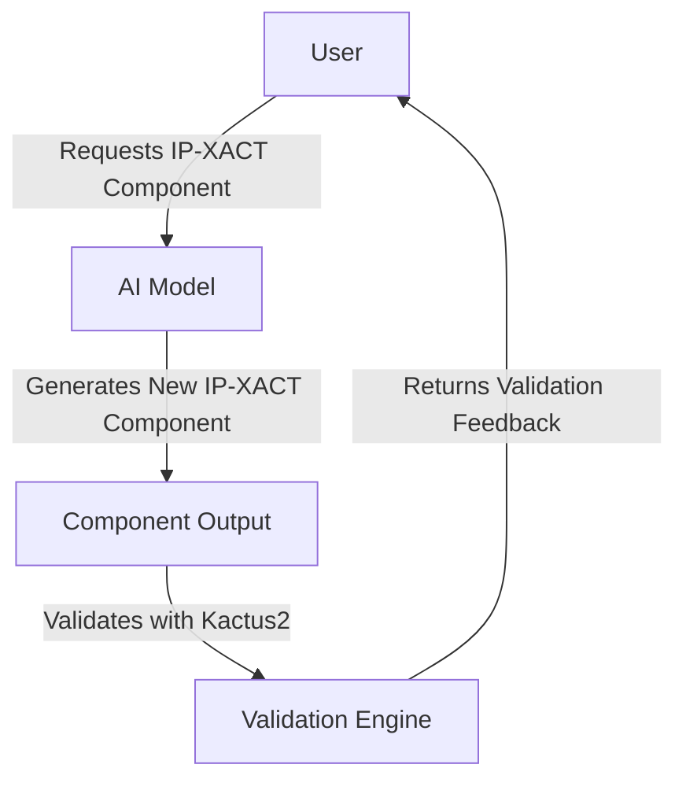

# AI-Powered IP-XACT Component Generator

## Scope of the Project
This project aims to automate the generation and validation of IP-XACT components using AI. By leveraging Large Language Models (LLMs) and structured XML-based datasets, the goal is to reduce manual effort and improve the efficiency of hardware design. The AI will be fine-tuned on existing IEEE1685/IP-XACT datasets, generate new components, and validate them using Kactus2, ensuring correctness and usability. This is a one-time or iterative fine-tuning process, meaning the model is trained beforehand and then used as-is, without continuous learning or refinement.

## Requirements
To develop a functional AI-powered IP-XACT generator, the following requirements must be met:

### Functional Requirements
- The system must be able to parse and process IP-XACT datasets.
- The AI must generate new IP-XACT components while maintaining compliance with IEEE1685.
- The generated components must be validated using Kactus2.
- The system should allow users to input constraints or preferences for component generation.
- The solution should provide feedback on validation results and suggest improvements.

### Non-Functional Requirements
- **Performance:** The AI model should generate components efficiently without excessive computational cost.
- **Scalability:** The system should handle large IP-XACT datasets and scale with increasing complexity.
- **Usability:** The user interface (if applicable) should be intuitive for engineers and designers.
- **Reliability:** Generated components must be both syntactically valid and functionally useful.
- **Security:** Any uploaded datasets must be handled securely to prevent data leaks.

## Use Case Diagram

## Example Use Cases

### Use Case 1: Generating an IP-XACT Component
**Actors:** User, AI Model, Kactus2

**Preconditions:** User requests a new IP-XACT component.

**Steps:**
1. User requests the generation of a new IP-XACT component.
2. AI generates a component based on the trained model.
3. AI sends the generated component to Kactus2 for validation.
4. Kactus2 provides validation feedback.
5. If errors exist, the user is notified and can request modifications.
6. Once validated, the component is marked as ready for use.

**Postconditions:** A valid, reusable IP-XACT component is generated and stored.

### Use Case 2: Validating an AI-Generated Component
**Actors:** AI Model, Kactus2

**Preconditions:** AI has generated a new IP-XACT component.

**Steps:**
1. AI submits the generated component to Kactus2.
2. Kactus2 checks the component for syntactic and structural validity.
3. Validation feedback is returned to the user.
4. If errors exist, the user can request modifications.
5. Once validated, the component is confirmed as IEEE1685-compliant and functional.

**Postconditions:** The component is confirmed to be IEEE1685-compliant and functional.

---
This document provides a structured overview of the AI-powered IP-XACT component generation project, detailing its scope, requirements, use cases, and a use case diagram.
